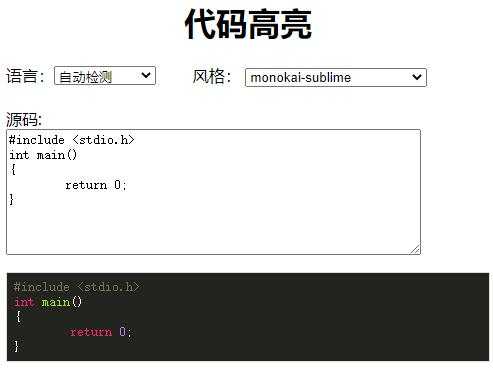

# highlight_demo
代码高亮、行号显示

## 使用 highlight
源码 https://github.com/highlightjs/highlight.js
<br/>下载 https://highlightjs.org/download/
```
<script src="highlight/highlight.pack.js"></script>
<script src="https://ajax.aspnetcdn.com/ajax/jQuery/jquery-3.5.0.min.js"></script>
<link id="code_css" rel="stylesheet" href="highlight/styles/monokai-sublime.css">
```

## 使用 highlightjs-line-numbers
源码 https://github.com/wcoder/highlightjs-line-numbers.js
<br/>无需下载
```
<script src="https://cdnjs.cloudflare.com/ajax/libs/highlightjs-line-numbers.js/2.5.0/highlightjs-line-numbers.min.js"></script>
```


